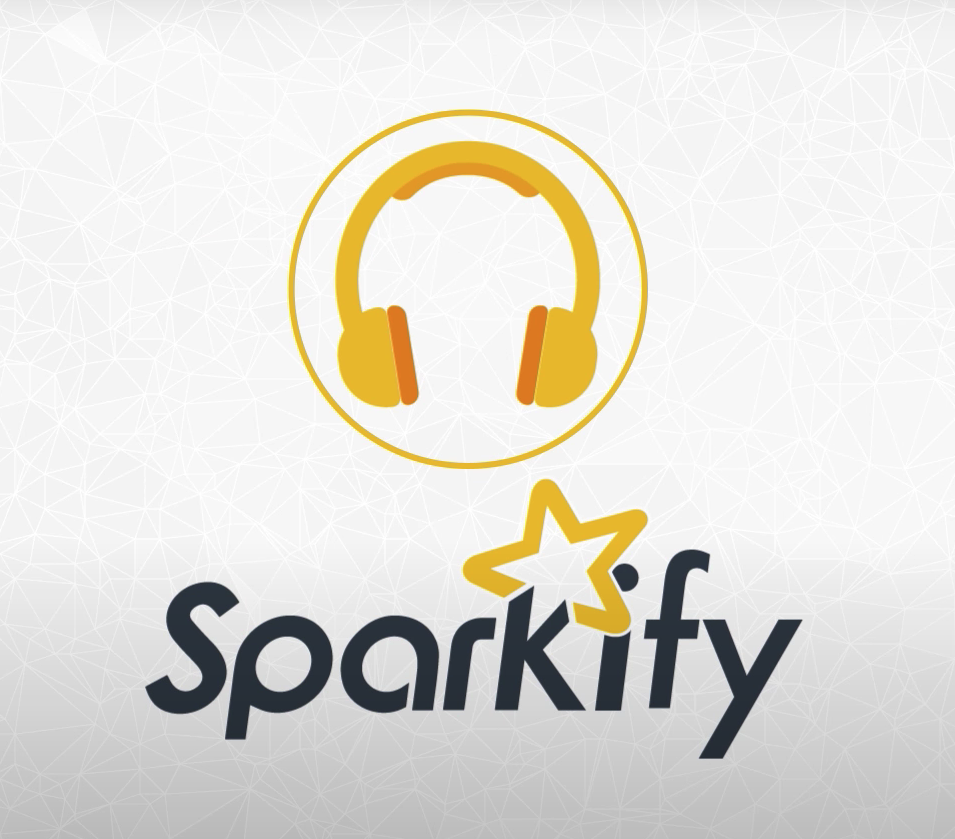

# Sparkify Project: Predicting Churn with Spark

-------------------------------------------------------------------------------

This repo contains a personal project on building a machine learning model to
predict churn of customers of a mockup application called Sparkify. The dataset
is provided by [Udacity](https://www.udacity.com/) as a resource for a capstone
project for Data Science Nanodegree program they host.

## Instalation
1. Make sure Anaconda is installed: [https://docs.continuum.io/anaconda/install/](https://docs.continuum.io/anaconda/install/).
2. Make sure the following Python packages are installed to run the notebook:
   * Python 3
   * Pyspark
   * Pandas
   * Numpy
   * Matplotlib
   * Seaborn

## Project Motivation
In this project, I am interested in building a machine learning model that could
predict user churning from a mockup application called Sparkify: a Spotify-like
application.

The dataset is consisted of users' web events and it needs to be
transformed further into a dataset with each unique user as a data point, as to
be able to feed the machine learning algorithm to build a prediction model.

## File Descriptions
There is only one Jupyter Notebook file here: `Sparkify.ipynb`. You could also
access the HTML version with the `Sparkify.html`.

## Results
The main findings of the data could be found on my Medium story here: 
[Medium Story](https://wisnumulya.medium.com/how-to-use-spark-to-predict-customer-churn-601099eb721e).
And the detailed analysis could be found on the `Sparkify.ipynb` file.

## Acknowledgements
* [Udacity](https://www.udacity.com/): sparkify mini dataset

## License
The content of thic package is covered under [the MIT License](./license.txt).
